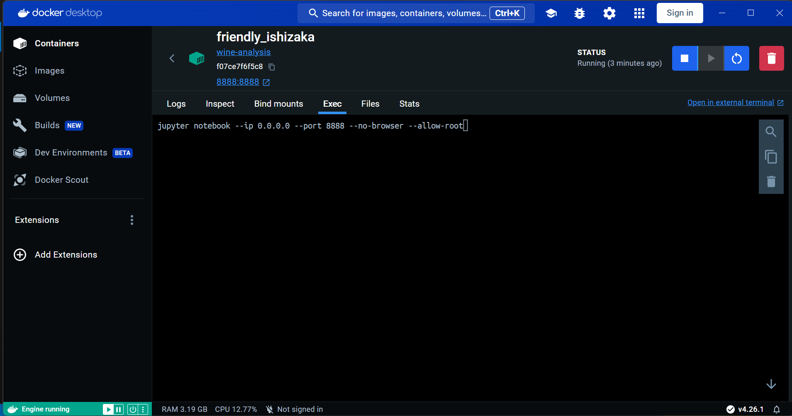
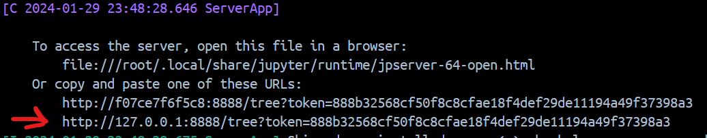

# Wine Analysis

## Description

This repository corresponds to a Data Science challenge given by [Romboost Company](https://www.linkedin.com/company/romboost/). The full description of it can be found in the attached `Challenge_Wine_Clustering.pdf`.

## Used Technologies

The project uses `python 3.11.5` with the following packages:

- requests 2.31.0 
- pandas 2.1.1 
- numpy 1.24.3 
- matplotlib 3.7.2 
- seaborn0.12.2 
- scikit-learn1.3.0 
- flask 2.2.5 
- jupyter 1.0.0

## Execution

There are two ways to execute the project.

For both, you have to clone the repository to your local machine

```bash
git clone https://github.com/martincalsina/Wine-Chemical-Analysis.git
```  

This project will need to use localhost ports `5000` to run the Flask web service to download the dataset (can be skipped if you do it manually) and `8888` for the Jupyter Notebook (in case you use Docker).

Once its done, you can choose to:

### Run with Docker Image

If you have Docker Desktop, you can follow the next instructions to build the project image and run a Docker container from it.

1. Go to your project directory and build the image

```bash
docker build -t wine-analysis .
```  

2. Run a Docker container

```bash
docker run -p 8888:8888 wine-analysis
```

3. Go to Docker Desktop `Exec` console and execute

```bash
jupyter notebook --ip 0.0.0.0 --no-browser --allow-root
```




4. Access to the generated hyperlink

It may look something like this

```bash
http://localhost:8888/?token=f3a8354eb82c92f5a12399fe1835bf8f31275f917928c8d2
```



It will redirect you to Jupyter Notebook, then you only need to select the `Wine_Analysis.ipynb` file to start running the analysis. The Dockerfile is set to automatically start running the Flask web server, which is used in one cell of the notebook to download the dataset. Just be sure that you have both `5000` and `8000` ports available.

### Run manually

You will need to have `python 3.11.5` installed and all the used dependencies.

Once you have python, you can install the rest with

```bash
pip install requests==2.31.0 pandas==2.1.1 numpy==1.24.3 matplotlib==3.7.2 seaborn==0.12.2 scikit-learn==1.3.0 flask==2.2.5 jupyter==1.0.0
```

In your console.

You will need to first run the `load_data.py` file via your favorite IDE or with the command

```bash
python load_data.py
```

in the repository directory.

This will run Flask web server in port `5000` to get the `wine-clustering.csv` dataset and save it into the `data/` folder using the `/donwload_csv` endpoint with a `GET` HTTP request (it is the only method that this .py has). Be sure that the `data/` folder exists. If you manually downloaded or pulled it from this repository, you could skip this step.

Then, you can start to execute the `Wine_Analysis.ipynb` Notebook in Jupyter or your IDE of preference.

Once the dataset is downloaded (after executing its correspond GET request in the Notebook), you can stop the server by using `CTRL+C` in the terminal in which you executed the `load_data.py`.